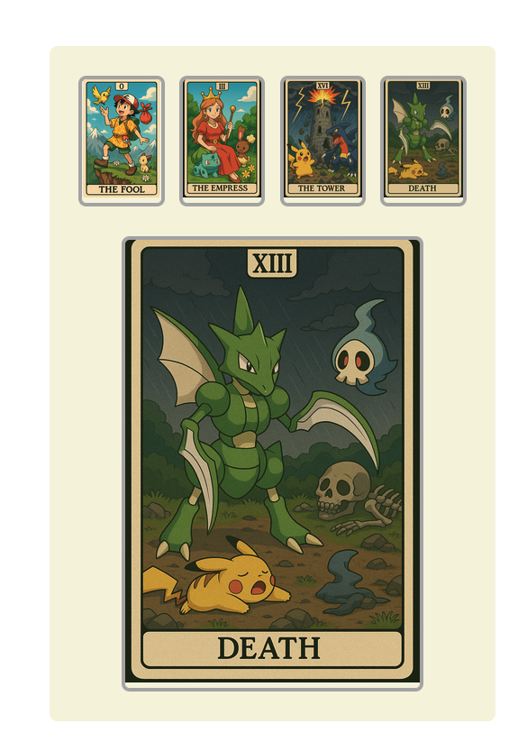

# INESDI 2025

## Session 2 [REFUERZO]

```sh
git clone https://github.com/manuartero/master-inesdi-session-2-refuerzo.git
cd master-inesdi-session-2-refuerzo
npm i && npm run dev
```



please check:

```js
{tarotCards.map((card, i) => (
    <Card key={`card-${i}`} variant={card} onClick={onClickCard} />
))}
```

```js
export function Card({ variant, size = "small", onClick }) {
    ...
}
```

and the [React State](https://react.dev/reference/react/useState)

```js
const [focusedCard, setFocusedCard] = useState();
```
